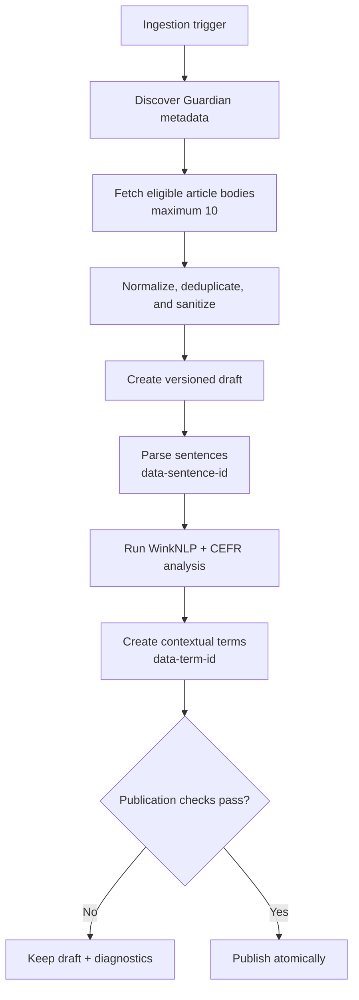
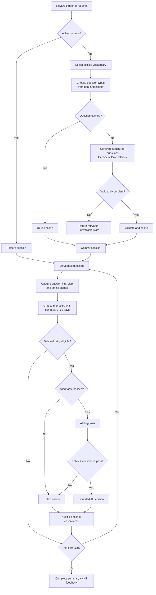

# 📚 Vocab Mate

**Learn English vocabulary through real-world news and adaptive review.**

Vocab Mate turns curated articles into contextual vocabulary practice. Learners
read, save words in their original sentences, and review them with deterministic
learning rules plus bounded AI assistance.

## 🔗 Repositories

| Repository | Purpose |
| --- | --- |
| [Frontend](https://github.com/gminh715/vocab-mate-frontend) |
| [Backend](https://github.com/gminh715/vocab-mate-backend) |
## ✨ Highlights

- English/Vietnamese interface, CEFR placement, and daily study goals.
- Article discovery, CEFR filtering, contextual highlights, and reading progress.
- Vietnamese meanings, English definitions, examples, pronunciation, and sentence translation.
- Immutable contextual vocabulary snapshots with notes and collections.
- Daily, article, collection, and quiz reviews with hints and spaced scheduling.
- Review history, skill feedback, reading history, and learning analytics.
- Guardian ingestion, local NLP/CEFR analysis, quiz management, and administration tools.

## 🏗️ Architecture

| Component | Responsibility |
| --- | --- |
| React client | UI, routing, forms, article reading, review interaction, and server-state caching |
| NestJS API | Auth, validation, content workflows, grading, scheduling, analytics, and AI orchestration |
| PostgreSQL + Prisma | Users, articles, contextual terms, vocabulary, quizzes, reviews, and audit records |
| Guardian + local NLP | News source, WinkNLP tokenization, and `cefr-analyzer` classification |
| Gemini + Groq | Structured enrichment, question generation, and bounded review decisions |

The API base path is `/api/v1`. Swagger is available at
`http://localhost:3000/api/docs`.

## 📰 Automated content pipeline

*System automation view; manual control points are intentionally omitted.*



- Guardian metadata and bodies come from its API; publisher pages are not scraped.
- `contentVersion` prevents stale parse, analysis, enrichment, or publication.
- First lookup lazily enriches pending terms through Gemini, then eligible Groq fallback.
- Saved vocabulary remains unchanged if source-term metadata later changes.

## 🤖 Agentic review pipeline

*System decisions are shown; user interaction is represented only as input signals.*



- Question content may be AI-generated; ordering, grading, scores, and schedules remain deterministic.
- Invalid, unavailable, disabled, low-value, or over-budget AI calls use rule fallback.
- One delayed re-test is allowed; applied interventions are audited.
- No partial session is created when required questions are unavailable.

## 🧰 Stack

| Area | Technology |
| --- | --- |
| Frontend | React 19, TypeScript 6, Vite 8, Material UI 9 |
| Client data | React Router 7, TanStack Query 5, Axios |
| Forms and i18n | React Hook Form, Zod, i18next |
| Backend | NestJS 11, TypeScript, Swagger/OpenAPI |
| Database | PostgreSQL, Prisma 7 |
| AI and NLP | Gemini, Groq, WinkNLP, `cefr-analyzer` |
| Testing | Vitest, Testing Library, Jest, Supertest, ESLint |

## 🚀 Local setup

### Prerequisites

Node.js, npm, PostgreSQL (`pgcrypto` and `citext`), Guardian, Gemini, and Groq
credentials.

### 1. Clone

```bash
git clone https://github.com/gminh715/vocab-mate-frontend.git
git clone https://github.com/gminh715/vocab-mate-backend.git
```

### 2. Start the backend

```bash
cd vocab-mate-backend
npm ci
cp .env.example .env
npm run prisma:validate
npm run prisma:generate
npx prisma migrate deploy
npm run start:dev
```

### 3. Start the frontend

```bash
cd vocab-mate-frontend
npm ci
cp .env.example .env
npm run dev
```

On PowerShell, use `Copy-Item .env.example .env`. Open
`http://localhost:5173`; the API runs at `http://localhost:3000`.

### Environment

| Side | Main variables |
| --- | --- |
| Frontend | `VITE_API_BASE_URL`, `VITE_API_PROXY_TARGET` |
| Backend | Database URLs, CORS, JWT/cookie settings, AI keys/models/budgets, `GUARDIAN_API_KEY` |

Never place secrets in `VITE_*` variables.

## 🔐 Trust boundaries

- Access tokens stay in memory; refresh tokens use an HttpOnly cookie.
- Concurrent `401` responses share one refresh and retry once.
- Backend guards and ownership checks are authoritative.
- Article HTML is sanitized and uses stable sentence/term markers.
- Provider keys remain server-side; AI output is schema-validated and bounded.
- AI never controls authentication, correctness, scores, or schedules.

## ✅ Checks

Frontend:

```bash
npm run lint
npm run typecheck
npm run test
npm run build
```

Backend:

```bash
npm run prisma:validate
npm test
npm run test:e2e
npm run build
```

Database-backed checks require a configured non-production PostgreSQL instance.

## 📄 License

Private project, currently `UNLICENSED`.
