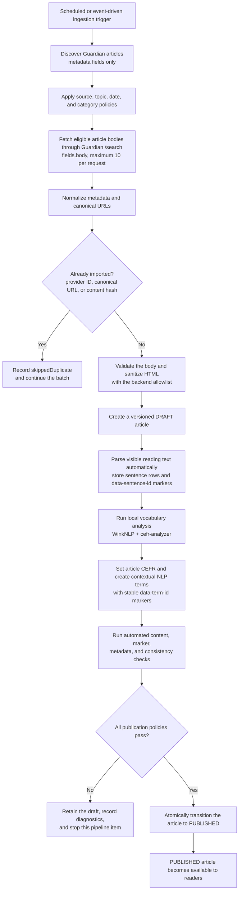
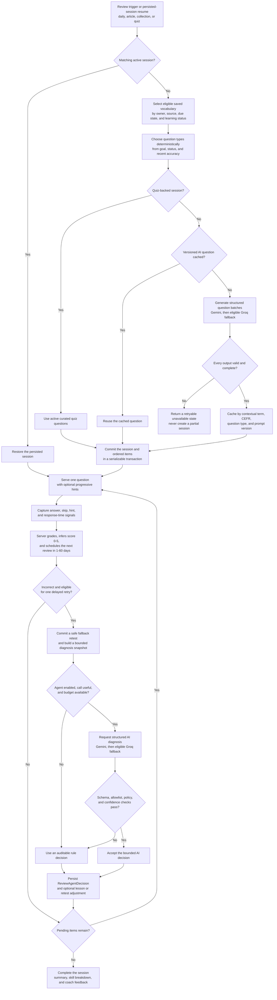

# Vocab Mate

**AI-assisted English vocabulary learning through real-world news.**

Vocab Mate is a full-stack learning platform that turns curated news articles
into contextual vocabulary practice. Learners read authentic English content,
inspect words in their original sentence, save durable vocabulary snapshots,
and review them through adaptive sessions that combine deterministic learning
rules with bounded, schema-validated AI assistance.

The source code is split across two repositories:

- [Vocab Mate Frontend](https://github.com/gminh715/vocab-mate-frontend)
- [Vocab Mate Backend](https://github.com/gminh715/vocab-mate-backend)

## Product overview

### Learner experience

- Complete a bilingual onboarding and CEFR placement flow, then choose a daily
  study target.
- Discover published articles by keyword, category, CEFR level, and recency.
- Read sanitized, backend-prepared article HTML with contextual term markers,
  backend-computed CEFR highlights, and persisted reading progress.
- Open a term in its exact sentence context to see its Vietnamese meaning,
  English definition, pronunciation, examples, collocations, related terms,
  and sentence translation.
- Save contextual vocabulary into one or more collections. Each save preserves
  an immutable learning snapshot rather than only storing a lemma.
- Start daily, article, collection, or published-quiz review sessions with four
  question types, progressive hints, invisible scoring, delayed retries, and
  spaced scheduling.
- Inspect review history, skill breakdowns, words to revisit, reading history,
  and learning analytics.
- Use the interface in English or Vietnamese.

### Administration experience

- Manage users, roles, account status, categories, articles, quizzes, and
  analytics.
- Discover and import Guardian content through the Guardian Content API,
  subject to the configured access tier and content licence, without exposing
  provider credentials to the browser.
- Edit rich article content, parse sentence boundaries, run local vocabulary
  and CEFR analysis, moderate terms, preview the final reader output, and
  explicitly publish or archive content.
- Build and publish article-linked quizzes with validated questions and answer
  options.

## System architecture

| Component | Responsibility |
| --- | --- |
| React web client | Routing, accessible UI, forms, session-aware API access, server-state caching, article reading, review interaction, and administration screens |
| NestJS REST API | Authentication, authorization, validation, content workflows, vocabulary ownership, grading, review scheduling, analytics, and AI orchestration |
| PostgreSQL + Prisma | Durable users, content versions, contextual terms, saved snapshots, collections, quizzes, review sessions, schedules, and agent decision audits |
| Guardian Content API | News discovery metadata and selected article bodies for draft import |
| WinkNLP + `cefr-analyzer` | Local sentence-term tokenization and CEFR analysis; article analysis does not call an LLM |
| Gemini + Groq | Structured contextual-term enrichment, review-question generation, and bounded review-agent decisions; Gemini is primary and Groq is the eligible fallback |

The public API uses the `/api/v1` base path. Local Swagger documentation is
available at `http://localhost:3000/api/docs` when the backend is running.

## Content acquisition, analysis, and publication pipeline

The diagram presents ingestion, analysis, validation, and publication as one
automated orchestration. Human approval and operational control points are
intentionally omitted from this system-level view.



Important implementation details:

- Guardian search returns normalized metadata without article-body HTML. Sync
  performs a separate, bounded provider request for selected bodies; publisher
  pages are never scraped.
- Every imported item is handled independently. Invalid bodies fail safely,
  duplicates are skipped, and a draft is compensated if automatic parsing
  cannot be finalized.
- `contentVersion` binds article HTML, sentence rows, and term markers. Parse,
  analysis, enrichment, and publication reject stale work instead of applying
  it to changed content.
- Local analysis creates approved, lookup-enabled `NLP` term occurrences with
  `PENDING` enrichment. Unknown local CEFR values remain nullable.
- After publication, the first learner lookup atomically claims a pending or
  failed term, requests structured enrichment from Gemini with an eligible
  Groq fallback, validates the response, and caches the resulting metadata as
  `READY`. Concurrent processing returns a safe retry response.
- Saving a term copies its contextual sentence, translation, meaning, examples,
  and lexical metadata into `UserVocabulary`; later source changes do not
  rewrite that saved snapshot.

## Agentic review pipeline

The review system keeps correctness and scheduling deterministic while allowing
AI to generate practice material and make a tightly constrained intervention
after a useful incorrect answer. The agent cannot change ownership,
correctness, scores, intervals, or authorization decisions.



Current review behavior includes the following safeguards:

- Non-quiz sessions warm a versioned AI question cache before committing the
  session. Questions are generated in small batches, deduplicated, validated,
  and never expose the correct answer before submission.
- The server grades multiple-choice and fill-in-the-blank answers, infers a
  score from correctness, retries, hints, question type, and response time,
  then updates spaced-review state transactionally.
- An item can be re-tested at most once and only after other pending items. The
  agent may choose an allowed question type, move the re-test by an allowed
  offset, attach a concise micro-lesson, or flag a future focus area.
- Obvious cases, disabled AI, low-value calls, exhausted budgets, provider
  errors, invalid output, and low-confidence output all resolve to a rule-based
  decision.
- Every applied intervention records its source, reason, bounded state snapshot,
  payload, prompt version, provider metadata, and latency for auditability.
- Session construction and item order are currently deterministic. Although
  the backend contains validated session-planning contracts and persistence
  primitives, the active start-session flow does not invoke the optional AI
  session planner.

## Technology stack

### Frontend

| Area | Technology |
| --- | --- |
| Application | React 19, TypeScript 6, Vite 8 |
| UI | Material UI 9, Emotion, TipTap |
| Routing and data | React Router 7, TanStack Query 5, Axios |
| Forms and validation | React Hook Form, Zod |
| Localization | i18next, react-i18next |
| Testing and quality | Vitest, Testing Library, ESLint |

### Backend

| Area | Technology |
| --- | --- |
| API | NestJS 11, TypeScript, Express, Swagger/OpenAPI |
| Database | PostgreSQL, Prisma 7, `pg` |
| Authentication | Passport JWT, BCrypt, HttpOnly refresh cookies |
| AI | Google GenAI SDK, Groq SDK, structured JSON schemas and runtime validation |
| NLP and HTML | WinkNLP, `cefr-analyzer`, `sanitize-html`, `htmlparser2` |
| Testing and quality | Jest, Nest testing utilities, Supertest, ESLint, Prettier |

## Repository structure

### Frontend

```text
vocab-mate-frontend/
├── public/
│   ├── assets/                 # Static placement-test vocabulary
│   └── favicon.svg
├── src/
│   ├── api/                    # Typed feature API functions
│   ├── app/                    # Root provider composition
│   ├── components/             # Shared and domain UI components
│   ├── config/                 # Axios client and browser infrastructure
│   ├── contexts/               # Authentication session context
│   ├── hooks/                  # TanStack Query and feature hooks
│   ├── i18n/                   # English and Vietnamese resources
│   ├── pages/                  # Route-level learner and admin screens
│   ├── routes/                 # Lazy route tree and access guards
│   ├── schemas/                # Zod form schemas
│   ├── types/                  # API contract types
│   └── utils/                  # Pure helpers and URL-state mapping
├── tests/                      # Vitest API, hook, and UI tests
└── vite.config.ts
```

### Backend

```text
vocab-mate-backend/
├── src/
│   ├── common/                 # Response, error, and shared utilities
│   ├── config/                 # Validated application configuration
│   ├── database/               # Shared Prisma service
│   └── modules/                # Feature-owned controllers and services
│       ├── ai/                 # Providers, schemas, validation, orchestration
│       ├── articles/           # Parsing, analysis, moderation, publication
│       ├── auth/               # JWT and cookie authentication
│       ├── news-ingestion/     # Guardian discovery and draft import
│       ├── reviews/            # Questions, grading, scheduling, review agent
│       └── ...                 # Users, reading, vocabulary, quizzes, analytics
├── prisma/
│   ├── models/                 # Domain-split Prisma schema
│   ├── migrations/             # Reviewed PostgreSQL migrations
│   └── seed.ts
└── test/
    ├── unit/
    ├── e2e/
    └── support/
```

## Getting started

### Prerequisites

- Node.js and npm
- PostgreSQL with permission to create or use the `pgcrypto` and `citext`
  extensions
- Guardian Content API credentials
- Google Gemini and Groq API credentials

The backend validates all required configuration at startup, including provider
values for features that may be disabled at runtime.

### 1. Clone both repositories

```bash
git clone https://github.com/gminh715/vocab-mate-frontend.git
git clone https://github.com/gminh715/vocab-mate-backend.git
```

Keep them as sibling directories for the commands below.

### 2. Configure and start the backend

```bash
cd vocab-mate-backend
npm ci
cp .env.example .env
```

On PowerShell, replace the copy command with:

```powershell
Copy-Item .env.example .env
```

Complete `.env`, then initialize and start the API:

```bash
npm run prisma:validate
npm run prisma:generate
npx prisma migrate deploy
npm run start:dev
```

Optional deterministic demo data:

```bash
npx prisma db seed
```

The API starts on `http://localhost:3000` by default.

### 3. Configure and start the frontend

In another terminal:

```bash
cd vocab-mate-frontend
npm ci
cp .env.example .env
npm run dev
```

PowerShell equivalent:

```powershell
Copy-Item .env.example .env
npm run dev
```

Open `http://localhost:5173`. Vite proxies `/api` to
`http://localhost:3000`, preserving a same-origin development flow for the
backend's HttpOnly refresh cookie.

## Environment configuration

### Frontend

Only public browser configuration belongs in `VITE_*` variables.

| Variable | Purpose | Default |
| --- | --- | --- |
| `VITE_API_BASE_URL` | Browser API base path or public API URL | `/api/v1` |
| `VITE_API_PROXY_TARGET` | Local Vite proxy target | `http://localhost:3000` |

Never place Guardian, Gemini, Groq, JWT, or database credentials in a `VITE_*`
variable.

### Backend

Use the backend `.env.example` as the authoritative list.

| Group | Variables |
| --- | --- |
| Database | `DATABASE_URL`, optional `DIRECT_URL` for migrations |
| Application | `PORT`, `CORS_ORIGIN`, `ANALYTICS_TIMEZONE` |
| Authentication | Access/refresh JWT secrets and expiries, BCrypt rounds, cookie security and SameSite settings |
| AI providers | Gemini and Groq keys/models plus the provider timeout |
| Review agent | Enable flag, total and diagnosis call budgets, confidence threshold, prompt version, and question warm-up limit |
| News | `GUARDIAN_API_KEY` |

For a cross-origin deployment, configure the frontend with the backend's full
public `/api/v1` URL and configure credentialed CORS plus secure cross-site
cookie settings on the backend.

## Authentication and trust boundaries

- The frontend keeps the access token in memory. The refresh token is managed
  only by the backend in an HttpOnly cookie scoped to the authentication API.
- Concurrent `401` responses share one refresh request, and an original request
  is retried at most once.
- `/api/v1/users/me` is the source of truth for identity, profile, and role.
- Route guards improve navigation, but NestJS guards and service ownership
  checks remain authoritative for authorization.
- Provider calls run outside long database transactions, use explicit timeouts,
  and never expose provider keys to the client.
- Backend-prepared article HTML is sanitized and rendered through stable
  `data-sentence-id` and `data-term-id` markers. The frontend does not rebuild
  sentence or vocabulary offsets.

## Available scripts

### Frontend scripts

| Command | Purpose |
| --- | --- |
| `npm run dev` | Start the Vite development server |
| `npm run typecheck` | Run the TypeScript project build without emitting app assets |
| `npm run lint` | Run ESLint |
| `npm run test` | Run the Vitest suite once |
| `npm run build` | Type-check and create a production build |
| `npm run preview` | Preview the production build locally |

### Backend scripts

| Command | Purpose |
| --- | --- |
| `npm run start:dev` | Start NestJS in watch mode |
| `npm run build` | Generate Prisma Client and compile the API |
| `npm run prisma:validate` | Validate the multi-file Prisma schema |
| `npm run prisma:generate` | Generate Prisma Client |
| `npm run prisma:verify-review-migrations` | Replay and verify review migrations in a disposable PostgreSQL schema |
| `npm test` | Run backend unit tests |
| `npm run test:e2e` | Run the Supertest E2E suite |
| `npm run lint` | Run ESLint with automatic fixes |

## Quality checks

Run the frontend checks from `vocab-mate-frontend`:

```bash
npm run lint
npm run typecheck
npm run test
npm run build
```

Run the backend checks from `vocab-mate-backend`:

```bash
npm run prisma:validate
npm test
npm run test:e2e
npm run build
```

Database-backed E2E tests and migration verification require a configured
non-production PostgreSQL environment.

## Current scope

Vocab Mate is an actively developed MVP. Article publication is administrator
controlled, vocabulary is sentence-contextual, and the backend remains the
authority for review grading and scheduling. AI enhances prepared content and
selected review decisions but is not trusted with authentication,
authorization, correctness, or direct database actions.

## License

This project is private and currently unlicensed (`UNLICENSED`).

